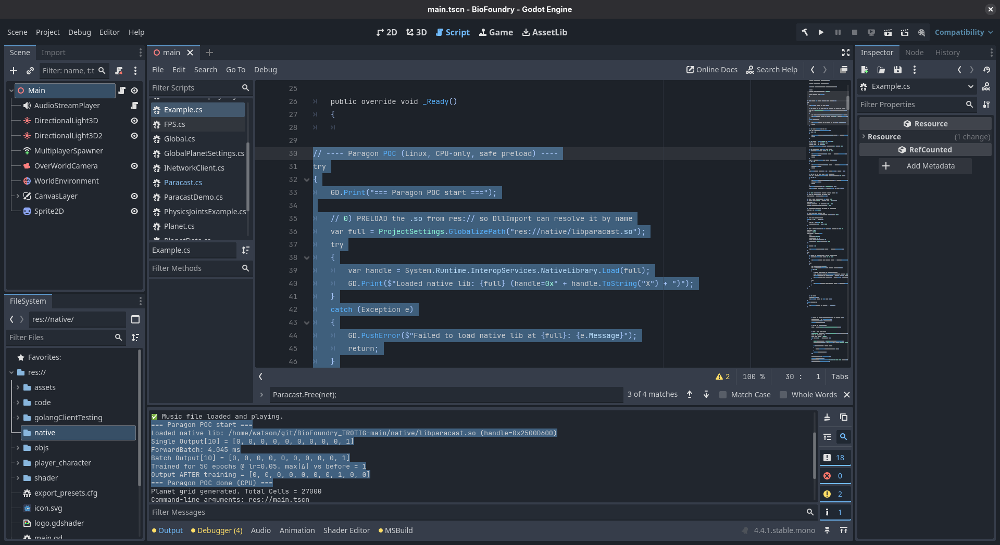

# ParacastDemo (C#)

This is a minimal C# console app that demonstrates how to call into the **Paracast** native library (`libparacast.so`) from .NET.

It mirrors the Python quick demo, showing:

- Forward inference before any training
- A first training round nudging the network toward a chosen class
- A second training round nudging toward another class
- Stress-testing with large batch inference
- Sample outputs for verification

---

## Requirements

- .NET SDK 9 (installed via your distro packages or [dotnet.microsoft.com](https://dotnet.microsoft.com))
- A compiled copy of `libparacast.so` (from the main Paracast build)
- Linux x64 (other platforms possible with small adjustments)

---

## Project Layout

```
ParacastDemo/
├── ParacastDemo.csproj
├── Program.cs
├── bin/Release/net9.0/ParacastDemo  <-- built binary
└── ../libparacast.so  <-- native library (keep in dist/ root)
```

---

## Build

From inside the `ParacastDemo/` folder:

```bash
dotnet build -c Release
```

The compiled binary will appear in:

```
bin/Release/net9.0/ParacastDemo
```

## Run

Make sure the native library is discoverable by the loader. The simplest way:

```bash
cd ~/git/paracast/dist
export LD_LIBRARY_PATH="$PWD:$LD_LIBRARY_PATH"
./ParacastDemo/bin/Release/net9.0/ParacastDemo
```

You should see output similar to:

```
🔧 create model

▶️  forward (cpu) — before any training
forward time: 0.0042s
output (first 10): [0.000, 0.000, ..., 1.000] | argmax = 6

🎓 first train (cpu) — nudging to class 9, 10 epochs, LR=0.1
train time: 10.8423s
▶️  forward (cpu) — after first train
...
```

## Notes

* The demo currently runs on CPU only (useGPU=0). You can extend it to flip useGPU=1 when calling Paracast_Train or Paracast_ForwardBatch to benchmark GPU performance.

* If you see DllNotFoundException: libparacast.so, check:
  * The .so is in dist/
  * LD_LIBRARY_PATH includes the folder
  * Run ldd libparacast.so to verify all dependencies are resolved


# Paracast in Godot (C#)

This demonstrates integrating the **Paracast** native library (`libparacast.so`) into a Godot project using C# scripting. It showcases basic forward inference and training calls from within a Godot scene, running on CPU (with GPU support extendable).



*Screenshot: Paracast demo output in Godot editor/console, showing model creation, forward inference, and training results.*


## License

Apache-2.0 (same as Paracast core)